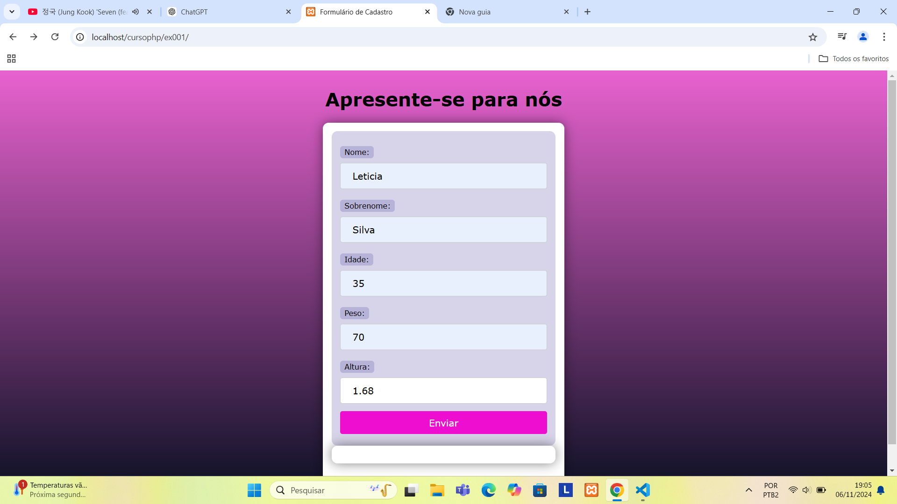

### Formulário

### Meu primeiro projeto em PHP

"Neste projeto, aprendi a construir um formulário simples usando HTML, PHP e CSS. Utilizei PHP para processar os dados recebidos do formulário e exibir uma mensagem personalizada ao usuário, com base nas informações fornecidas (nome, sobrenome, idade, peso e altura). Para isso, trabalhei com as supervariáveis $_GET e $_REQUEST do PHP. Além disso, utilizei CSS para estilizar o formulário e o layout da página. Também explorei como tratar entradas de dados ausentes utilizando o operador ?? e fiz a depuração de erros de sintaxe no código PHP. Como parte da experiência, criei uma navegação simples com JavaScript, permitindo que o usuário volte para a página anterior."

Contato:(11)95433-9681
E-mail:lslima1320@gmail.com